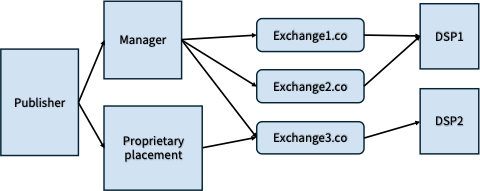

Released August 2022

ご意見やご質問は support@iabtechlab.com までメールでお寄せください。このドキュメントは [https://iabtechlab.com/ads.txt](https://iabtechlab.com/ads.txt) でオンライン公開されています。

© IAB Technology Laboratory

# 1. Background (背景)

2017 年の導入以来、Authorized Digital Sellers (ads.txt) は、プログラマティックエコシステムにおける不正、特に不当表示（別名「ドメインなりすまし」）や広告インベントリの不正販売を減らすための成功したツールとなってきました。その後の sellers.json と SupplyChain オブジェクトの作成により、セラーの追加開示が進み、サプライチェーン全体の透明性が向上しました。これらの仕様がほぼ全面的に採用されたことで、バイヤーは ads.txt、sellers.json、OpenRTB SupplyChain を組み合わせて使用し、サプライチェーンのより包括的なビューを持つことが可能になりました。

しかし、パブリッシャー、広告サプライ管理会社、SSP/アドエクスチェンジの間で実装ニーズや仕様の解釈が異なるため、ads.txt を通じたサプライの表現に関する課題が浮上しています。この提案は、ads.txt を進化させ、不正削減におけるその強みを維持し、sellers.json を通じてセラー関係の透明性を高め、サプライチェーン透明性標準のより大きなスイートへと仕様を橋渡しすることを目的としています。

具体的には、このアップデートは以下の課題と改善の機会に対処します：

- **セラー関係の正確な表現**: ads.txt/app-ads.txt を sellers.json に直接リンクすることで、サプライパス最適化 (SPO) のニーズに対応し、ads.txt ファイルの `DIRECT`/`RESELLER` 値が正確に記述されるようにします。
- **インベントリの主要または独占的なセラーという概念の導入**: バイヤーは、インベントリを購入するための「ホップ数」を最小限に抑えることに関心を示しています。パブリッシャーが収益化の大部分を外部委託している場合、最も直接的なルートはリセラー経由である可能性があります。このアップデートでは、`MANAGERDOMAIN` を通じて、広告管理会社やセールスハウスがパブリッシャーのインベントリの主要または独占的な代表者として識別される方法を開発します。
- **ドメイン/アプリの所有権の理解**: sellers.json にリストされている `sellers.domain` と ads.txt ファイルをより適切に接続するために、所有・運営（owned and operated）されているドメインやアプリを、そのドメインやアプリを所有するエンティティに遡って識別することをサポートする方法を開発します。

# 2. Scope (範囲)

## In Scope (対象範囲)

**ビジネス関係**: このソリューションは、グローバルまたは地域のエンティティがサイトまたはアプリからインベントリを購入するための最も直接的なルートとなる、**独占的または主要な収益化パートナーシップ**関係をカバーします。また、**所有**・運営されているドメインやアプリを、そのドメインやアプリを所有するエンティティに遡って識別する方法もカバーします。

**潜在的な悪用ベクトルの削減**: これらのソリューションは、ads.txt と sellers.json 間の検証をより密接に結び付けるのに役立つことを意図しています。

1. sellers.json の `PUBLISHER` エントリのセラードメインと ads.txt の `OWNERDOMAIN` を接続する
2. サプライパスに複数のホップが含まれるインベントリへの独占的なパスをより適切に表現する

## Out of Scope (対象外)

**ビジネス関係**: このソリューションは、特定の広告フォーマットタイプの独占的な収益化パートナーであることを表現する方法をカバーしていません。これは ads.txt 仕様で表現するには複雑すぎると判断されました。

# 3. Updates to Ads.txt & App-Ads.txt Standard (Ads.txt および App-Ads.txt 標準の更新)

ads.txt 標準の更新については、こちらをご覧ください：[https://iabtechlab.com/wp-content/uploads/2022/04/Ads.txt-1.1.pdf](https://iabtechlab.com/wp-content/uploads/2022/04/Ads.txt-1.1.pdf)

以下の使用例は、「セラー」と販売されている基盤となるドメインとの関係は何か？ という問いに答えるのに役立ちます。

# 4. Example Use Cases (使用例)

### Definitions (定義):

- **Manager (マネージャー) -** [（公式定義については仕様内の定義を参照）](https://iabtechlab.com/wp-content/uploads/2022/04/Ads.txt-1.1.pdf) サイトの所有者が収益化を管理していない場合、外部の指定された収益化パートナーがマネージャーと見なされます。これらのパートナーシップは、範囲がグローバルな場合もあれば、特定の地域に限定される場合もあり、新しいマネージャーのテスト目的で特定のサブドメインに限定される場合もあります。
  - _MANAGERDOMAIN と INVENTORYPARTNERDOMAIN の使用に関する注記: `MANAGERDOMAIN` は、パブリッシャーのインベントリの主要または独占的なプログラマティックセラーを表し、マネージャーがパブリッシャーのインベントリへの最も直接的な（Direct）パスであることを示すために使用されます。マネージャーは、パブリッシャーとバイヤー間のエンドツーエンドの取引における追加の参加者です。これらの関係は通常、マネージャーがパブリッシャーに代わって販売したインベントリの売上の一定割合を受け取るというレベニューシェア契約に基づいています。マネージャーは、ビッドリクエストの `schain` オブジェクトにおいても末端ノードとして表されることが期待されます。対照的に、`INVENTORYPARTNERDOMAIN` は、リストされている基盤となるアプリ上の広告の一部を販売する権利を所有または保持している会社を表すために使用されます。これは、その会社が基盤となる CTV/OTT アプリと「インベントリ共有」契約を結んでいる場合に使用されることが期待されます。これらの取引では、インベントリパートナーが取引における最終的な受取人であり、販売された広告からの全収益を受け取ることが期待されます。さらに、インベントリパートナーのドメインは、「インベントリ共有」が一般的である CTV/OTT インベントリで主に使用されることが期待されます。_
- **Proprietary Placement Provider (独自のプレースメントプロバイダー) -** 独自のプレースメント (Proprietary placements) は、パブリッシャーが収益化の管理を仲介者に委任する広告ユニットです。この仲介者は、DSP に直接ビッドリクエストを発行する場合もあれば、リセリングエクスチェンジを介してビッドリクエストを発行する場合もあります。
- **GEO** - 地理的地域。以下の使用例では、GEO は国を表します。これは、国ごとのマネージャー宣言を可能にする `MANAGERDOMAIN` 仕様定義をサポートするためです。

## CASE A: Publisher inhouse monetization (パブリッシャーのインハウス収益化)

**ビジネスシナリオ:** パブリッシャーが自社のインベントリを内部で収益化します。彼らはエクスチェンジ上のシートを運用しています。Publisher.com は site.com を所有するビジネスエンティティです。

#### Publisher -> Exchange -> DSP

| **Bid Request** | **Publisher’s Authorized Sellers (Ads.txt)** | **Sellers.json** | **Validation** | **Answer** |
| --- | --- | --- | --- | --- |
| DSP receives a bid request for a placement on site.com sold by exchange.com (sid 1234) `"site.domain" : "site.com"` `"publisher.id" : "1234"` `"schain" : { "nodes": [ { "sid" : "1234", "asi" : "exchange.com" } ] }` | `site.com/ads.txt` `OWNERDOMAIN = publisher.com` `exchange.com, 1234, DIRECT` | `exchange.com/sellers.json` `{ "seller_id" : "1234", "name" : "Publisher", "domain" : "publisher.com", "seller_type" : "Publisher" }` | `IF sellers.domain = OWNERDOMAIN THEN seller is owner of publisher.com` `IF sellers.domain = MANAGERDOMAIN THEN seller is manager of publisher.com` `IF sellers.domain = MANAGERDOMAIN + GEO THEN seller is manager of publisher.com for GEO` `IF sellers.domain != OWNERDOMAIN or MANAGERDOMAIN THEN seller is reseller of inventory` | Seller 1234 is owner of site.com and DIRECT path to inventory |

## CASE B: Publisher managed monetization (パブリッシャー管理の収益化)

**ビジネスシナリオ:** このケースは、パブリッシャーが独占的な収益化パートナーを通じてインベントリを収益化している場合を表しています。サプライパスには複数のホップが含まれますが、サプライパス最適化 (SPO) の観点からは、依然としてインベントリを購入するための最も直接的なルートです。

#### Publisher -> Manager -> Exchange -> DSP

次ページのリクエスト/レスポンス表を参照してください。

| **Bid Request** | **Publisher’s Authorized Sellers (Ads.txt)** | **Sellers.json** | **Validation** | **Answer** |
| --- | --- | --- | --- | --- |
| DSP receives a bid request for a placement on site.com sold by manager.com (sid 5678) through exchange.com (sid 1235) `"site.domain" : "site.com"` `"publisher.id" : "1235"` `"schain" : { "nodes": [ { "sid" : "5678", "asi" : "manager.com" }, { "sid" : "1235", "asi" : "exchange.com" } ] }` | `site.com/ads.txt` `OWNERDOMAIN = publisher.com` `MANAGERDOMAIN = manager.com` `manager.com, 5678, DIRECT` `exchange.com, 1235, RESELLER` | `manager.com/sellers.json` `{ "seller_id" : "5678", "name" : "Publisher", "domain" : "publisher.com", "seller_type" : "Publisher" }` `exchange.com/sellers.json` `{ "seller_id" : "1235", "name" : "Manager", "domain" : "manager.com", "seller_type" : "Intermediary" }` | `IF sellers.domain = OWNERDOMAIN THEN seller is owner of publisher.com` `IF sellers.domain = MANAGERDOMAIN THEN seller is manager of publisher.com` `IF sellers.domain = MANAGERDOMAIN + GEO THEN seller is manager of publisher.com for GEO` `IF sellers.domain != OWNERDOMAIN or MANAGERDOMAIN THEN seller is reseller of inventory` | Seller 1235 is the monetization Manager of site.com and is the _most_ DIRECT path to inventory. Seller 5678 is the owner of site.com which has a DIRECT relationship with Manager |

## CASE C: Publisher managed monetization; country specific (パブリッシャー管理の収益化；国固有)

**ビジネスシナリオ:** このケースは、パブリッシャーが特定の国の独占的な収益化パートナーを通じてインベントリを収益化している場合を表しています。サプライパスには複数のホップが含まれますが、サプライパス最適化 (SPO) の観点からは、依然としてインベントリを購入するための最も直接的なルートです。

#### Publisher -> Manager + GEO -> Exchange -> DSP

次ページのリクエスト/レスポンス表を参照してください。

| **Bid Request** | **Publisher’s Authorized Sellers (Ads.txt)** | **Sellers.json** | **Validation** | **Answer** |
| --- | --- | --- | --- | --- |
| DSP receives a bid request for a placement on site.com sold by saleshouseDE.com (sid 9876) through exchange.com (sid 1236) `"site.domain" : "site.com"` `"publisher.id" : "1236"` `"schain" : { "nodes": [ { "sid" : "9876", "asi" : "saleshouseDE.com" }, { "sid" : "1236", "asi" : "exchange.com" } ] }` | `site.com/ads.txt` `OWNERDOMAIN = publisher.com` `MANAGERDOMAIN = saleshouseDE.com, DE` `saleshouseDE.com, 9876, DIRECT` `exchange.com, 1236, RESELLER` | `saleshouseDE.com/sellers.json` `{ "seller_id" : "9876", "name" : "Publisher", "domain" : "publisher.com", "seller_type" : "Publisher" }` `exchange.com/sellers.json` `{ "seller_id" : "1236", "name" : "Salehouse DE", "domain" : "saleshouseDE.com", "seller_type" : "Intermediary" }` | `IF sellers.domain = OWNERDOMAIN THEN seller is owner of publisher.com` `IF sellers.domain = MANAGERDOMAIN THEN seller is manager of publisher.com` `IF sellers.domain = MANAGERDOMAIN + GEO THEN seller is manager of publisher.com for GEO` `IF sellers.domain != OWNERDOMAIN or MANAGERDOMAIN THEN seller is reseller of inventory` | Seller 1236 is the monetization manager of site.com for DE only and is the _most_ DIRECT path to inventory. Seller 9876 is the owner of site.com which has a DIRECT relationship with Saleshouse DE |

## CASE D: Publisher inhouse monetization for proprietary placement type (独自のプレースメントタイプ向けパブリッシャーインハウス収益化)

**ビジネスシナリオ:** パブリッシャーが自社のインベントリを内部で収益化します。独自のプレースメントタイプを持つシートを直接運用しています。

#### Publisher -> Proprietary Placement -> DSP

次ページのリクエスト/レスポンス表を参照してください。

| **Bid Request** | **Publisher’s Authorized Sellers (Ads.txt)** | **Sellers.json** | **Validation** | **Answer** |
| --- | --- | --- | --- | --- |
| DSP receives a bid request for a placement on site.com sold by proprietaryplacement.com (sid 45678) `"site.domain" : "site.com"` `"publisher.id" : "45678"` `"schain" : { "nodes": [ { "sid" : "45678", "asi" : "proprietaryplacement.com" } ] }` | `site.com/ads.txt` `OWNERDOMAIN = publisher.com` `MANAGERDOMAIN = manager.com` `manager.com, 5678, DIRECT` `exchange.com, 1235, RESELLER` `proprietaryplacement.com, 45678, DIRECT` | `proprietaryplacement.com/sellers.json` `{ "seller_id" : "45678", "name" : "Publisher", "domain" : "publisher.com", "seller_type" : "Publisher" }` | `IF sellers.domain = OWNERDOMAIN THEN seller is owner of site.com` `IF sellers.domain = MANAGERDOMAIN THEN seller is manager of site.com` `IF sellers.domain = MANAGERDOMAIN + GEO THEN seller is manager of site.com for GEO` `IF sellers.domain != OWNERDOMAIN or MANAGERDOMAIN THEN seller is reseller of inventory` | Seller 45678 is the owner of site.com and DIRECT path to proprietary placement inventory. |

## CASE E: Resale of publisher inhouse monetization for proprietary placement type (独自のプレースメントタイプ向けパブリッシャーインハウス収益化の再販)

**ビジネスシナリオ:** パブリッシャーが自社のインベントリを内部で収益化します。独自のプレースメントタイプを持つシートを直接運用しています。独自のプレースメントベンダーはその後、そのインベントリをエクスチェンジ上で販売します。

#### Publisher -> Proprietary Placement -> Exchange -> DSP

次ページのリクエスト/レスポンス表を参照してください。

| **Bid Request** | **Publisher’s Authorized Sellers (Ads.txt)** | **Sellers.json** | **Validation** | **Answer** |
| --- | --- | --- | --- | --- |
| DSP receives a bid request for a placement on site.com sold by proprietaryplacement.com (sid 45678) through exchange.com (sid 1238) `"site.domain" : "site.com"` `"publisher.id" : "1238"` `"schain" : { "nodes": [ { "sid" : "45678", "asi" : "proprietaryplacement.com" }, { "sid" : "1238", "asi" : "exchange.com" } ] }` | `site.com/ads.txt` `OWNERDOMAIN = publisher.com` `MANAGERDOMAIN = manager.com` `manager.com, 5678, DIRECT` `exchange.com, 1235, RESELLER` `proprietaryplacement.com, 45678, DIRECT` `exchange.com, 1238, RESELLER` | `proprietaryplacement.com/sellers.json` `{ "seller_id" : "45678", "name" : "Publisher", "domain" : "publisher.com", "seller_type" : "Publisher" }` `exchange.com/sellers.json` `{ "seller_id" : "1238", "name" : "Proprietary Placement", "domain" : "proprietaryplacement.com", "seller_type" : "Intermediary" }` | `IF sellers.domain = OWNERDOMAIN THEN seller is owner of site.com` `IF sellers.domain = MANAGERDOMAIN THEN seller is manager of site.com` `IF sellers.domain = MANAGERDOMAIN + GEO THEN seller is manager of site.com for GEO` `IF sellers.domain != OWNERDOMAIN or MANAGERDOMAIN THEN seller is reseller of inventory` | Seller 1238 is not the owner or manager of site.com and is a reseller path to underlying inventory. Seller 45678 is the owner of site.com and Proprietary Placement is a DIRECT path to the underlying inventory. |

## CASE F: owned inventory from Media Owner + Monetization Manager that has BOTH owned and resold inventory (所有と再販の両方を持つメディアオーナー + 収益化マネージャーからの所有インベントリ)

**ビジネスシナリオ:** インベントリを販売するエンティティは、異なるインベントリにおいて、メディアオーナーであり収益化マネージャーでもあります。以下は、エンティティが所有するインベントリについて期待される内容を示しています。

#### Publisher -> Exchange -> DSP

[ ads-txt-1.1-implementation-guide/Figure6](./images/Figure6.png)

次ページのリクエスト/レスポンス表を参照してください。

| **Bid Request** | **Publisher’s Authorized Sellers (Ads.txt)** | **Sellers.json** | **Validation** | **Answer** |
| --- | --- | --- | --- | --- |
| DSP receives a bid request for a placement on site.com sold by exchange.com (sid 1240) `"site.domain" : "site.com"` `"publisher.id" : "1240"` `"schain" : { "nodes": [ { "sid" : "1240", "asi" : "exchange.com" } ] }` | `site.com/ads.txt` `OWNERDOMAIN = xyzmedia.com` `exchange.com, 1240, DIRECT` | `exchange.com/sellers.json` `{ "seller_id" : "1240", "name" : "XYZ Media", "domain" : "xyzmedia.com", "seller_type" : "Both" }` | `IF sellers.domain = OWNERDOMAIN THEN seller is owner of publisher.com` `IF sellers.domain = MANAGERDOMAIN THEN seller is manager of publisher.com` `IF sellers.domain = MANAGERDOMAIN + GEO THEN seller is manager of publisher.com for GEO` `IF sellers.domain != OWNERDOMAIN or MANAGERDOMAIN THEN seller is reseller of inventory` | Seller 1240 is owner of site.com and DIRECT path to inventory |

## CASE G: Resold inventory from Media Owner + Monetization Manager that has BOTH owned and resold inventory (所有と再販の両方を持つメディアオーナー + 収益化マネージャーからの再販インベントリ)

**ビジネスシナリオ:** インベントリを販売するエンティティは、異なるインベントリにおいて、メディアオーナーであり収益化マネージャーでもあります。以下は、エンティティが別のパブリッシャーに代わって販売しているインベントリについて期待される内容を示しています。

#### Publisher -> Manager -> Exchange -> DSP

次ページのリクエスト/レスポンス表を参照してください。

| **Bid Request** | **Publisher’s Authorized Sellers (Ads.txt)** | **Sellers.json** | **Validation** | **Answer** |
| --- | --- | --- | --- | --- |
| DSP receives a bid request for a placement on site.com sold by xyzmedia.com (sid 123xyz) through exchange.com (sid 1240) `"site.domain" : "site.com"` `"publisher.id" : "1240"` `"schain" : { "nodes": [ { "sid" : "123xyz", "asi" : "exchange.com" }, { "sid" : "1240", "asi" : "exchange.com" } ] }` | `site.com/ads.txt` `OWNERDOMAIN = publisher.com` `xyzmedia.com, 123xyz, DIRECT` `exchange.com, 1240, RESELLER` | `xyzmedia.com/sellers.json` `{ "seller_id" : "123xyz", "name" : "Publisher", "domain" : "publisher.com", "seller_type" : "Publisher" }` `exchange.com/sellers.json` `{ "seller_id" : "1240", "name" : "XYZ Media", "domain" : "xyzmedia.com", "seller_type" : "Both" }` | `IF sellers.domain = OWNERDOMAIN THEN seller is owner of publisher.com` `IF sellers.domain = MANAGERDOMAIN THEN seller is manager of publisher.com` `IF sellers.domain = MANAGERDOMAIN + GEO THEN seller is manager of publisher.com for GEO` `IF sellers.domain != OWNERDOMAIN or MANAGERDOMAIN THEN seller is reseller of inventory` | Seller 1240 is not the owner or manager of site.com and is a RESELLER path to underlying inventory. Seller 123xyz is the owner of site.com and ZYZ Media is a DIRECT path to the underlying inventory. |

# Implementation Guidelines (実装ガイドライン)

## Publisher Guidance (パブリッシャー向けガイダンス)

- ウェブサイトのドメインとオーナーのドメインが同じであっても、`OWNERDOMAIN=` を公開することが推奨されます（RECOMMENDED）。
  - 特に、所有者でありセラーでもあるセラーの場合、バイヤーが所有インベントリと再販インベントリを区別できるように、`OWNERDOMAIN` を公開することが強く推奨されます。可能な場合の別の推奨事項として、サプライパスの各タイプをより明確に表すために、販売シートを分けることも挙げられます。
- インベントリの大部分が単一のエンティティによって管理されている場合にのみ、`MANAGERDOMAIN` を使用することが推奨されます（RECOMMENDED）。`MANAGERDOMAIN` の正確な解釈は、ads.txt の利用者（バリデーター、計測、不正防止ソリューション、バイイングプラットフォームなど）の裁量に委ねられており、SPO に影響を与える可能性があります。たとえば、同じインベントリが複数のセラーを通じて利用可能であり、それでも `MANAGERDOMAIN` を使用している場合、バイヤーは他の非マネージャーアカウントを `RESELLER` エントリとして扱う可能性があります。
- 競合する `MANAGERDOMAIN` エントリ（例：同じ国の複数の `MANAGERDOMAIN`）は使用しないべきです（SHOULD NOT）。その情報の利用者はおそらくこれらを無視します。
- この作業の一部は、ads.txt ファイルの精度のクリーンアップを支援するために行われています。この機会を利用して、ファイル内のすべての `DIRECT` エントリが、直接アカウント管理権限を持つセラーアカウントへの参照であることを検証してください。
- 対応する sellers.json ファイルで `PUBLISHER` となっている、ads.txt 内の承認されたすべてのアカウントは、ads.txt 内の `OWNERDOMAIN` と一致する `sellers.domain` を sellers.json 内に持つべきです（SHOULD）。

## SSP/Exchange Guidance (SSP/エクスチェンジ向けガイダンス)

- これらの `OWNERDOMAIN` および `MANAGERDOMAIN` の検証には、ads.txt と sellers.json の両方との照合が必要です。
- sellers.json 内の `sellers.domain` が、販売アカウントの `OWNERDOMAIN` および `MANAGERDOMAIN` とそれぞれ一致していることを確認してください。
- ads.txt エントリをより厳密に検証し、正しいフィールド 3 の値が含まれていることを確認することを検討してください。SSP/エクスチェンジはパブリッシャーとの関係を把握しているため、パブリッシャーが ads.txt ファイルでフィールド 3 を正しく宣言しているかどうかを簡単に確認できます。

## DSP Guidance (DSP 向けガイダンス)

- これらの `OWNERDOMAIN` および `MANAGERDOMAIN` の検証には、ads.txt と sellers.json の両方との照合が必要です。DSP は、リスク軽減のメリットと SPO のために、このデータを利用し、それに基づいて行動することが推奨されます（RECOMMENDED）。
- `MANAGERDOMAIN` の正確な解釈は各 DSP の裁量に委ねられており、SPO に重大な影響を与える可能性があります。DSP が以下のガイダンスと異なる場合は、`MANAGERDOMAIN` に関するポリシーを施行する前に、パブリッシャー、SSP、およびパートナーに対して明確なガイドラインを公開することが推奨されます（RECOMMENDED）。
- DSP への推奨事項は以下のとおりです：
  - `MANAGERDOMAIN` が宣言されているにもかかわらず、他のソースを通じて利用可能なインベントリがかなり見られる場合（`MANAGERDOMAIN` が独占的ではないことを示唆）、他のトラフィックソースをインベントリの `RESELLER` として扱ってもかまいませんが、独占的ではない非悪意のユースケースが存在することにも注意してください。追加の検証が推奨されます。
  - 同じインベントリが `OWNERDOMAIN` セラーと `MANAGERDOMAIN` セラーの両方から利用可能である場合、`MANAGERDOMAIN` エントリが誤ってマークされている可能性があります（直接、およびマネージャー経由でインベントリを販売しているということは、パブリッシャーがセールスハウスのような外部エンティティにイールドマネジメントを外部委託していないことを意味するため）。
  - 同じ国に対して複数の `MANAGERDOMAIN` が存在する場合、利用者はその国に対して `MANAGERDOMAIN` が宣言されていないものとして扱う（つまり、その宣言は無効である）ことが推奨されます（RECOMMENDED）。
  - マネージャーによって収益化される広告機会において、`MANAGERDOMAIN` にリストされたドメインは、完全な SupplyChain オブジェクト内の発信元のパブリッシャーを表すノードのドメインでもあることが期待されます。
